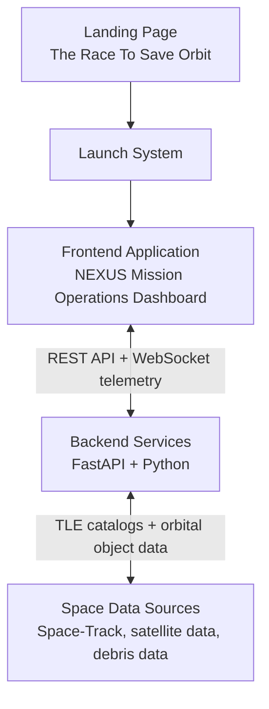

# Orbital Shield AI: NEXUS System Architecture

NEXUS is a Space Situational Awareness (SSA), Space Traffic Management, and orbital collision avoidance platform. The product is intentionally split into two different layers: a public awareness experience and a mission operations application.

## Product Boundary

### Layer 1 - Landing Experience: "The Race To Save Orbit"

The landing page is the storytelling and education layer.

- Explains the orbital debris problem.
- Explains collision risk and Kessler Syndrome.
- Shows ESA-style statistics and public awareness material.
- Creates urgency before the operator enters the system.
- Routes users into the platform through **Launch System**.

This layer is not the primary frontend application and should not be treated as the operational product.

### Layer 2 - NEXUS Mission Operations Platform

The actual application begins only after the user clicks **Launch System**. The current Collision Avoidance System dashboard is the real frontend product: a Mission Operations Command Center for detection, risk assessment, maneuver planning, AI-assisted analysis, and operator decision support.

## Correct Application Flow

```text
Landing Page
  |
  v
Launch System
  |
  v
NEXUS Mission Operations Dashboard
  |
  v
Detection
  |
  v
Risk Assessment
  |
  v
Maneuver Call
  |
  v
AI Systems
  |
  v
72-Hour Protocol
  |
  v
Operator Decision
```

## Architecture Diagram



The landing page is a separate awareness layer. The frontend application is the Mission Operations Dashboard that starts after **Launch System**.

## Frontend Responsibilities

The frontend starts after **Launch System** and represents the operational Collision Avoidance System UI.

**Frontend stack**

- Next.js
- React
- TypeScript
- Framer Motion
- Three.js
- React Three Fiber

**Frontend modules**

1. **Detection Interface**
   - Purpose: detect potential conjunction events between satellites and debris.
   - Outputs: closest approach distance, relative velocity, detection confidence.

2. **Risk Assessment Interface**
   - Purpose: calculate probability of collision.
   - Outputs: Low Risk, Medium Risk, High Risk, Critical Risk.

3. **Maneuver Recommendation Interface**
   - Purpose: generate and present collision avoidance recommendations.
   - Outputs: Delta-V, burn direction, fuel impact, mission impact.

4. **AI Analysis Interface**
   - Purpose: explain the situation to human operators.
   - Outputs: threat summaries, risk explanations, maneuver comparisons, operator assistance.
   - Safety boundary: AI never directly controls satellites; the human operator remains in control.

5. **72-Hour Simulation Interface**
   - Purpose: project orbital behavior for the next 72 hours.
   - Outputs: future conjunctions, collision forecasts, safe maneuver windows, risk timelines.

6. **Live Conjunction Alerts**
   - Streams active warnings and high-priority conjunction events.

7. **Orbital Visualization**
   - Shows satellites, debris, orbits, threat vectors, and conjunction zones.

8. **Mission Control Dashboard**
   - Hosts the operational panels, system status, alert context, and operator workflow.

## Backend Responsibilities

The backend is the data and computation engine beneath the Mission Operations Dashboard.

**Backend stack**

- FastAPI
- Python

**Backend responsibilities**

- TLE Data Ingestion
- Space-Track Integration
- Orbit Propagation
- Conjunction Analysis
- Collision Prediction
- Risk Scoring
- Maneuver Generation
- 72-Hour Forecasting
- AI Reasoning
- WebSocket Streaming

## Backend Pipeline

```text
Satellite Data + Debris Data
  |
  v
SGP4 Orbit Propagation
  |
  v
Conjunction Detection
  |
  v
Collision Probability Analysis
  |
  v
Risk Classification
  |
  v
Maneuver Engine
  |
  v
AI Evaluation
  |
  v
72-Hour Simulation
  |
  v
Operator Recommendation
```

## Source Layout

- `space-collision-system/frontend/app/page.tsx` - Landing Experience route.
- `space-collision-system/frontend/app/dashboard/page.tsx` - NEXUS Mission Operations Dashboard route.
- `space-collision-system/frontend/components/landing/` - Storytelling and awareness sections.
- `space-collision-system/frontend/components/` - Mission operations dashboard modules.
- `backend-aimodel/orbital-debris/backend/` - FastAPI backend services and SSA computation pipeline.
- `backend-aimodel/orbital-debris/README.md` - Backend architecture and setup notes.

## Operating Principle

NEXUS should read as a professional aerospace monitoring system: an SSA platform, Space Traffic Management system, orbital collision avoidance platform, and Mission Operations Command Center. The landing page creates awareness; the dashboard supports operational decision-making.

## License

MIT License
