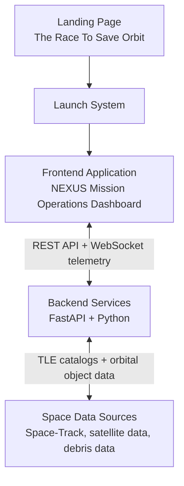

# NEXUS Mission Operations Platform - Backend Services

This directory documents the backend services for the **NEXUS Mission Operations Platform**. These services sit beneath the Mission Operations Dashboard and provide the Space Situational Awareness (SSA), Space Traffic Management, and orbital collision avoidance computation layer.

The landing page is not part of the backend contract. It is an awareness layer that routes users into the dashboard through **Launch System**. Once operators enter the dashboard, the backend supports detection, risk assessment, maneuver planning, AI-assisted reasoning, and 72-hour forecasting.

## System Position



## Backend Responsibilities

The backend acts as the computational engine for the Mission Operations Command Center. It manages data ingestion, orbital mechanics, conjunction analysis, collision prediction, maneuver recommendation, AI reasoning, and real-time streaming.

**Tech stack**

- FastAPI
- Python

**Core responsibilities**

- **TLE Data Ingestion**: ingest satellite and debris orbital element data.
- **Space-Track Integration**: connect to external space object catalogs.
- **Orbit Propagation**: use SGP4-style propagation to project object positions.
- **Conjunction Analysis**: detect close approaches between satellites and debris.
- **Collision Prediction**: estimate probability of collision from conjunction geometry and uncertainty.
- **Risk Scoring**: classify events as Low, Medium, High, or Critical risk.
- **Maneuver Generation**: recommend Delta-V, burn direction, fuel impact, and mission impact.
- **72-Hour Forecasting**: project risk timelines and safe maneuver windows.
- **AI Reasoning**: summarize threats, explain risks, and compare maneuver options for operators.
- **WebSocket Streaming**: deliver real-time telemetry and alert updates to the dashboard.

## Backend Pipeline Architecture

```text
Satellite Data + Debris Data
  |
  v
SGP4 Orbit Propagation
  |
  v
Conjunction Detection
  |
  v
Collision Probability Analysis
  |
  v
Risk Classification
  |
  v
Maneuver Engine
  |
  v
AI Evaluation
  |
  v
72-Hour Simulation
  |
  v
Operator Recommendation
```

## Module Contracts

### Detection

Detect potential conjunction events between satellites and debris.

**Outputs**

- Closest approach distance
- Relative velocity
- Detection confidence

### Risk Assessment

Calculate probability of collision and classify the event.

**Outputs**

- Low Risk
- Medium Risk
- High Risk
- Critical Risk

### Maneuver Call

Generate collision avoidance recommendations for operator review.

**Outputs**

- Delta-V
- Burn direction
- Fuel impact
- Mission impact

### AI Systems

Explain the situation and assist operators.

**AI responsibilities**

- Summarize threats
- Explain risks
- Compare maneuver options
- Assist operators

AI never directly controls satellites. The human operator remains in control.

### 72-Hour Protocol

Project orbital behavior for the next 72 hours.

**Outputs**

- Future conjunctions
- Collision forecasts
- Safe maneuver windows
- Risk timelines

## Setup Instructions

### Backend Local Setup

```bash
cd backend
python -m venv venv
source venv/bin/activate   # Windows: venv\Scripts\activate
pip install -r requirements.txt
cp ../.env.example .env
# Edit .env with your Space-Track.org credentials
uvicorn main:app --reload --port 8000
```

### Loading Data

```bash
# Pull latest debris TLEs from Space-Track.org
curl -X GET http://localhost:8000/api/tle/fetch?limit=2700

# Verify
curl http://localhost:8000/health
```

## Operator Safety Boundary

Backend AI output is decision support only. It can explain risk, compare maneuver options, and recommend operator actions, but it must not be framed as autonomous satellite control.

## License

MIT License
